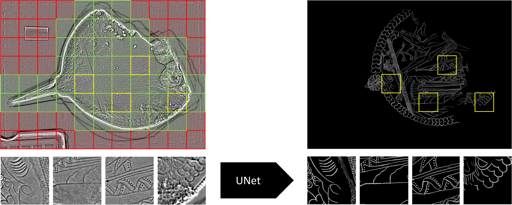

# ICDAR 2024 - Code to our Paper

__Rafael Sterzinger, Simon Brenner, and Robert Sablatnig: ["Drawing the Line: Segmenting Art from Ancient Etruscan Mirrors"](https://arxiv.org/abs/2404.15903)__

Note that, data will be provided at a later stage [here](https://www.oeaw.ac.at/acdh/tools/arche).

## Overview



In order to segment artistic lines from damaged Etruscan hand mirrors, we employ a deep segmentation network, in our case a UNet, on a per-patch level ($512\times512$, stride $256$; resized to $256\times256$): Green denotes patches used during training, red, patches not used during training and yellow, ones that are included within the current mini-batch (32 patches). At inference, predictions are performed for all patches and are recombined to form the complete segmentation mask of a mirror.

## Data

Please, download the data and store it in the following structure:

```
STORAGE
├── train //will be created automatically
├── val
└── train_unlabelled

DIR_ROOT
├── ANSA-VI-1011
│   └── PS
│       ├── ANSA-VI-1011_V_N.tif
│       ├── ANSA-VI-1011_V_RHO.tif
│       ├── ...
│       ├── ANSA-VI-1011_R_N.tif
│       ├── ANSA-VI-1011_R_RHO.tif
│       └── ANSA-VI-1011_R_U.tif
├── ...
├── GT_REL //folder for ground truth annotation
│   ├── ANSA-VI-1695_R_drawings.png
│   └── ...
└── MASKS_REL
    ├── ANSA-VI-1011_R_mask.png
    └── ...
```

## Installation

Setup the environment by typing the following:

    conda env create -f environment.yml
    conda activate etmira
    pip install -r requirements.txt

Note that this process might take some time.
Next, continue to define path variables and wandb information in ```user_config.py```, which is used for logging. 

Finally, to preprocess the raw data for the training run:

    python -m setup --use_labelled True

Additionally, run ```python -m setup --use_labelled False``` in order to set up the data for cross-pseudo-supervision experiments. Note, however, that this will require lots of memory.

## Training

In order to start training using the parameters of our best-reported model, type the following:

    python -m train

Additionally, after successful training, inference will be performed on the whole mirror _ANSA-VI-1700_, using the model with the highest pseudo-F-Measure.
If interested, parameters can be adjusted via command line arguments (see ```train.py```). After training, model weights will be stored under ```{WANDB_PROJECT}/{run_id}/checkpoints/epoch=*.ckpt```

## Inference

In order to run inference on any mirror, run the following:

    python -m eval --ckpt CHECKPOINT_OF_MODEL --eval_mirror MIRROR_TO_RUN_INFERENCE_ON

The output will be stored in the folder where the checkpoint is located.

## Contact
In case you have questions or find some errors, do not hesitate to contact me rsterzinger(at)cvl.tuwien.ac.at. 

## References
Please consider citing our paper!

    @misc{sterzinger2024drawing,
      title={Drawing the Line: Deep Segmentation for Extracting Art from Ancient Etruscan Mirrors}, 
      author={Rafael Sterzinger and Simon Brenner and Robert Sablatnig},
      year={2024},
      eprint={2404.15903},
      archivePrefix={arXiv},
      primaryClass={cs.CV}
    }
